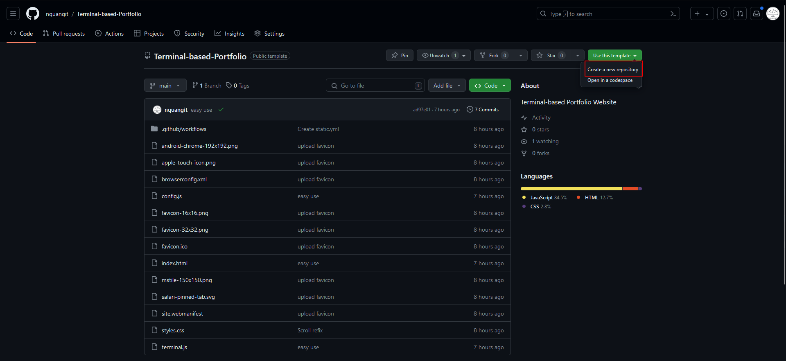
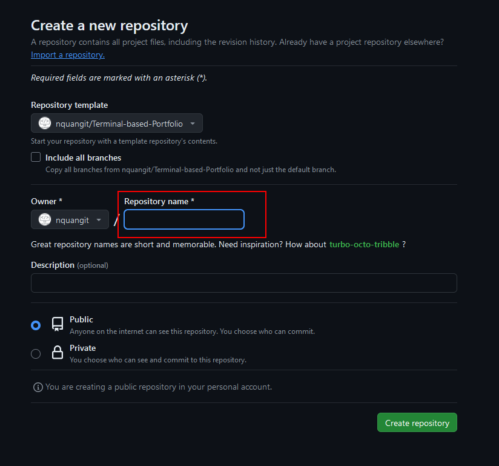
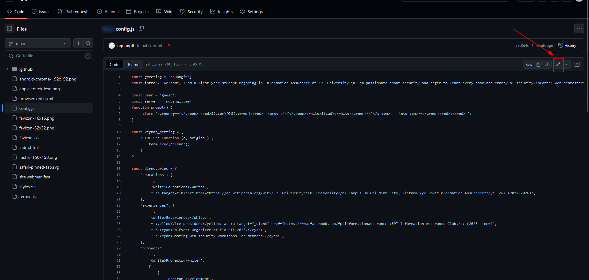

# How to use Terminal-based-Portfolio
---

#### First, go the the repository page and click Use this template.

#### Enter your repository name and click Create repository.
*(You can also clone the repository and push it to your own repository)*

#### The repository's visibility can be set to public or private.

#### Change the information in the `config.js` file to your own information.

After editing the `config.js` file, press `Commit changes` to save the changes.

After the commit is made, the changes will be reflected in the portfolio. The Github Actions will automatically deploy the changes to the Github Pages.

#### To view the portfolio, go to the `Settings` tab in the repository.

- Scroll down to the `Pages` section.
- Click on the link to view the portfolio.